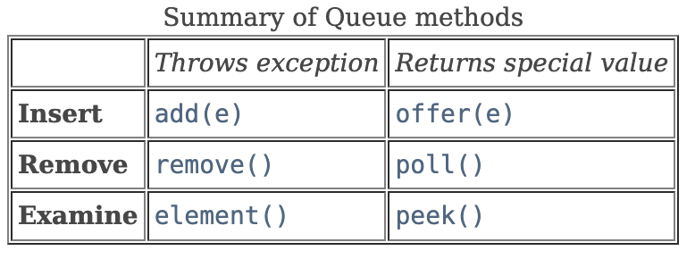

## 1. 절댓값 힙

[문제 보기](https://www.acmicpc.net/problem/11286)


### 문제 분석

- input
  - 첫째 줄에 연산의 개수 N(1≤N≤100,000)이 주어진다.
  - 다음 N개의 줄에는 연산에 대한 정보를 나타내는 정수 x가 주어진다
    - 만약 x가 0이 아니라면 배열에 x라는 값을 넣는(추가하는) 연산이고, x가 0이라면 배열에서 절댓값이 가장 작은 값을 출력하고 그 값을 배열에서 제거하는 경우이다. 입력되는 정수는 -231보다 크고, 231보다 작다.
- 시간 제한: 1초


### 핵심 아이디어

문제 이름부터 절댓값 '힙'을 만들라고 하고있다.
`PriorityQueue`의 Comparator를 오버라이딩해서, 절댓값을 기준으로 정렬하도록 하면 된다.
절댓값이 같은 경우는 더 작은 수를 우선으로 한다.

### 기록해 둘 이야기

java의 `PriorityQueue`는 `Queue` 인터페이스를 구현하고있다.
Queue 의 비슷한 동작의 같은 메서드들이 헷갈려서 정리를해보려고한다.


특히 `remove()` 와 `poll()` 둘 중에 나는 '그냥' poll 을 사용 중이었는데, 위 표와같이 remove의 경우 큐가 비어있을 때 예외를 던지고, poll은 그렇지 않다고 한다.

그러니, 내 코드처럼 `poll()` 을 사용하는 경우 큐가 비어있어도 예외가 발생하지 않고, null을 반환하기만 하므로 다음과 같이 코드를 작성해도 아무런 문제가 발생하지 않는다.

```java
if (operator == 0) {
    // if (priorityQueue.isEmpty()) {
    //     sb.append(0 + "\n");
    //     continue;
    // }
    Integer polled = priorityQueue.poll();
    sb.append(polled == null ? 0 : polled + "\n");
    continue;
    }
```
