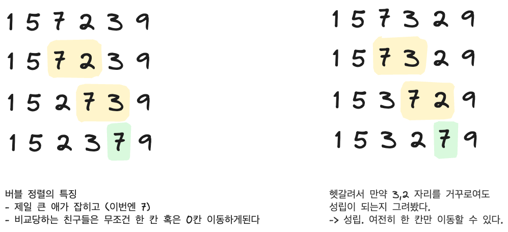

## 2. 버블 소트

[문제 보기](https://www.acmicpc.net/problem/1377)


### 문제 분석


- input
  - 첫째 줄에 N이 주어진다. N은 500,000보다 작거나 같은 자연수이다.
  - 둘째 줄부터 N개의 줄에 A[1]부터 A[N]까지 하나씩 주어진다. A에 들어있는 수는 1,000,000보다 작거나 같은 자연수 또는 0이다.
- 시간 제한: 2초


### 핵심 아이디어

문제에서 언제 무엇을 출력하는지 다시 살펴보자.

```c++
bool changed = false;
for (int i=1; i<=N+1; i++) {
    changed = false;
    for (int j=1; j<=N-i; j++) {
        if (A[j] > A[j+1]) {
            changed = true;
            swap(A[j], A[j+1]);
        }
    }
    if (changed == false) {
        cout << i << '\n';
        break;
    }
}
```
`changed` 가 한번도 `true`가 되지 않은 경우, 즉 버블 정렬 시 한번도 swap 이 일어나지 않았다는 것을 의미한다.
그리고, **버블정렬에서 swap이 일어나지 않았다는 것은 이미 모든 수가 정렬되어있다는 것을 의미**한다.

아래 그림은 i=0일 때의 루프를 그린 것이다.


그러면 정렬이 완료된 i + 1 을 출력하고 break 가 되는 것이겠다.
그런데 이 로직 그대로 코드를 짜면 버블정렬을 그대로 사용하는 것이기 때문에 시간초과가 된다.

그러므로 우회적으로 이 버블소트가 몇번 i loop을 돌았는지 구해야하는 것이다.
그렇다면 **i loop 이 '한 번' 돌때 달라지는 것이 무엇이냐를 고민해야한다.**

-> i loop 이 한 번 돌면 앞으로 옮겨지는 칸수는 최대 1칸이다. (뒤로 가는거 말고 앞으로 가는거)

난 이게 머리로 바로 이해가 되지 않아서 그 다음 루프 (7 뒤로보내는 루프)를 손으로 그려봤다.


for loop 한 번 당 최대 한 앞으로 가니까, 가장 많이 앞으로 움직인 요소가 얼만큼 움직였는지를 알아내면 되는 것이었다.

-> 문제와는 조금 다른 접근 방식으로, sort() 메서드로 먼저 정렬하고 나서 인덱스를 가지고 계산한다.

+) 여기서 추가로 적용된 아이디어는, 정렬이 된 후에 원래의 인덱스를 요소가 기억하고 있어야하므로 객체로 만들어 요소 자체가 본인의 원래 인덱스를 기억하게 만드는 것이었다. 

```java
class Element implements Comparable {
    private int index;
    private int value;

    public Element(final int index, final int value) {
        this.index = index;
        this.value = value;
    }

    @Override
    public int compareTo(final Object o) {
        Element other = (Element) o;
        return this.value - other.value;
    }

    public int getIndex() {
        return index;
    }

    public int getValue() {
        return value;
    }

}
```


### 기록해 둘 이야기 (헷갈렸던 것, 모르겠는 것)

핵심 아이디어에서.. for i loop 이 한 번 돌 때의 특징을 설명했는데
이걸 나 혼자서는 생각해내지 못해서 책을 읽었는데, 그래도 이해가 되지 않아 다른 블로그들을 참고해서 이해해냈다.

나중에 한 번 더 읽고 이해하려면 꼼꼼히 적어둬야 할 것 같아 손으로 루프를 그리니까 받아들여졌다.

혼자 문제 풀 때는 규칙을 찾기 위해서 이런식으로 펜으로 끄적여보기라도 해보면 좋을 것 같다. 그러려면 버블 정렬이 어떤 식으로 일어나는지 확실히 이해하고 기억해두어야한다.