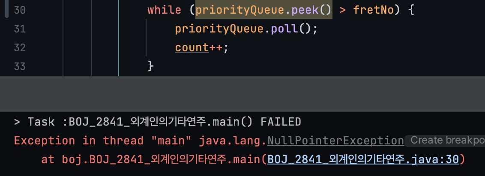

## 3. 외계인의 기타 연주

[문제 보기](https://www.acmicpc.net/problem/2841)


### 문제 분석


- input
  - 첫째 줄에 멜로디에 포함되어 있는 음의 수 N과 한 줄에 있는 프렛의 수 P가 주어진다. (1 ≤ N ≤ 500,000, 2 ≤ P ≤ 300,000)
  - 다음 N개 줄에는 멜로디의 한 음을 나타내는 두 정수가 주어진다.
    - 첫 번째 정수는 줄의 번호이고 두 번째 정수는 그 줄에서 눌러야 하는 프렛의 번호이다. 입력으로 주어진 음의 순서대로 기타를 연주해야 한다.
    - 줄의 번호는 N보다 작거나 같은 자연수이고, 프렛의 번호도 P보다 작거나 같은 자연수이다.
- 시간 제한: 1초


### 핵심 아이디어

기타줄마다 priorityQueue를 만들어줬다. 만약 손가락을 떼야한다면 어디부터 떼야할지 바로 알 수 있도록 `Comparator` 를 내림차순으로 오버라이딩.
```java
List<PriorityQueue<Integer>> strings = new ArrayList<>();
for (int i = 0; i < 6; i++) {
    strings.add(new PriorityQueue<>((a, b) -> b - a));
}
```

이렇게 하고 나서, 줄마다 연산을 수행하며 손가락이 이동할 때 `count` 변수에 1을 더하면 된다.


### 기록해 둘 이야기 (헷갈렸던 것, 모르겠는 것)

null을 반환하는 경우 처리를 해주자.

이번주 월요일 절댓값힙을 풀때는 `poll()` 만을 사용해서, 큐가 비어있어도 예외가 발생하지 않았었다.
이 문제에서도 `peek()`을 사용했기 때문에 큐가 비어있다고 예외가 발생하지는 않지만,
큐가 비어있으면 `peek()`의 반환값이 null이 되어 비교연산자를 사용하면 예외가 발생했다.



```java
while (priorityQueue.peek() > fretNo) { // ! NullPointerException
    priorityQueue.poll();
    count++;
}

if (priorityQueue.peek() == fretNo) { // ! NullPointerException
    continue;
}
```


따라서 다음과 같이 코드를 변경해주었다.

```java
while (!priorityQueue.isEmpty() && priorityQueue.peek() > fretNo) {
    priorityQueue.poll();
    count++;
}
if (!priorityQueue.isEmpty() && priorityQueue.peek() == fretNo) {
    continue;
}
```

그리고 이런 생각이 들었다. 이런 경우에는 peek을 사용할 게 아니라 `element()` 를 사용하는 게 더 알맞을 수도 있겠구나.
비교연산자에 사용될 것이니, null을 반환하는 가능성을 차단하는 것이다.